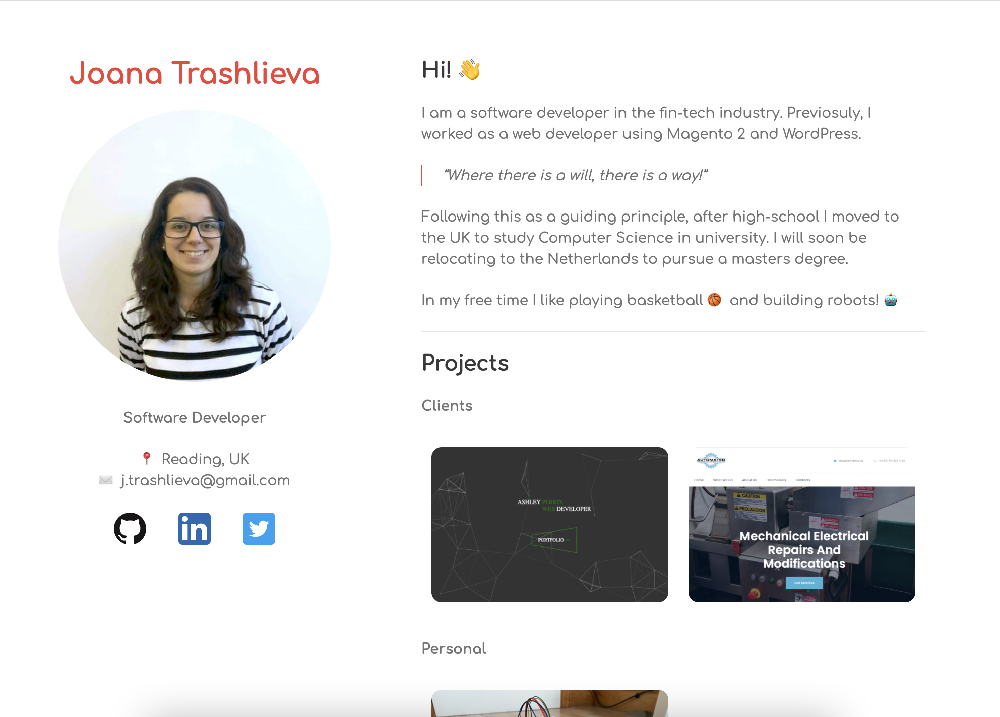

# Personal website using GitHub Pages and Jekyll themes

[joanatrashlieva.github.io](https://joanatrashlieva.github.io)

Previously, I have written my website in CMSs such as Wordpress or even in Magento 2 for a short time. 
But the maintanance of custom hosting, SSL, emails, etc. is too much for just a hobby. 
So I decided to give GitHub Pages a go. 

# Current state


[](https://github.com/JoanaTrashlieva/JoanaTrashlieva.github.io/actions/workflows/slack-notify.yml)



# Instagram issue

There are some pictures I wanted to display that were posted on Instagram. I decided to use the Instagram API but that proved to be very clunky and ultimately did not end up to be useful for me. I went on and found a tool already developed, [Phantom Buster](https://phantombuster.com/), that is an automated ci/cd using Node containers. 

I set up one that scrapes instagram based on given profiles and extracts media and assoicated data based on a specifically given # - Instagram Hashtag Collector (#editsByJoanaTrashlieva).

That automation launches daily @ 20:42 and creates a json file that contains all information from the posts that are containing the specified #.

# Setting up a GH Actions workflow

Now having that json file (luckily, the url doesn't change on each run) I set up a workflow in GitHub to write the contents of that file in the repository and commit it (and send me a Slack notification). That would run everyday @ 20:45 (3 mins after the container from Phantom Buster).

```
name: Get JSON file from scrapper

# Scheduler to run action ones a day @ 10am (currently every 5 mins for testing)
on:
  schedule:
   - cron:  '45 20 * * *'

# All jobs the action makes
jobs:
  getJson:
    runs-on: ubuntu-latest
    steps:

      # Checkout current branch / repo?
        - uses: actions/checkout@v2
          with:
            ref: ${{ github.head_ref }}

      #Get contents from url and write then to file in repo (WOKRING)
        - uses: suisei-cn/actions-download-file@v1
          id: jsonContent
          name: Download the file
          with:
            url: "https://cache1.phantombooster.com/plBOJLwVHsA/0dssBQ5XSfnRTJ53UMdTUw/results.json"
            target: assets/
              
      # Commit chnages to repo
        - name: Git Auto Commit
          uses: stefanzweifel/git-auto-commit-action@v4.8.0
          with:
            commit_message: Auto commit instagram scrapper json file
```
