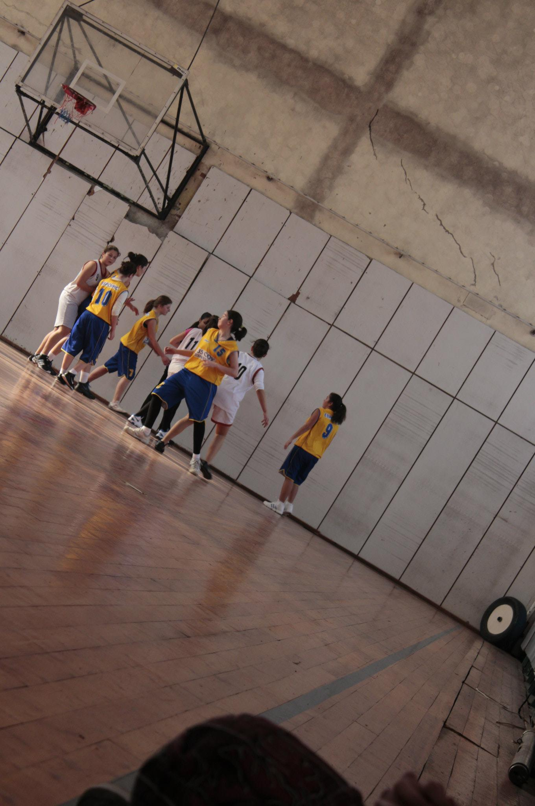
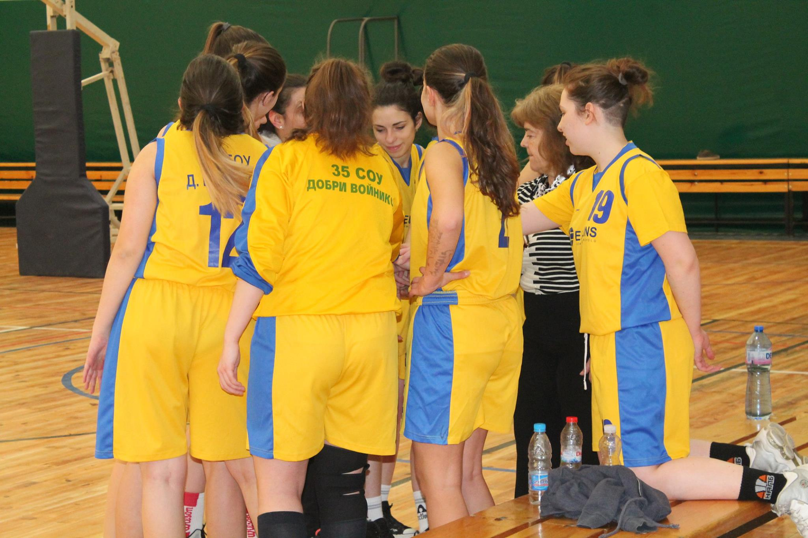
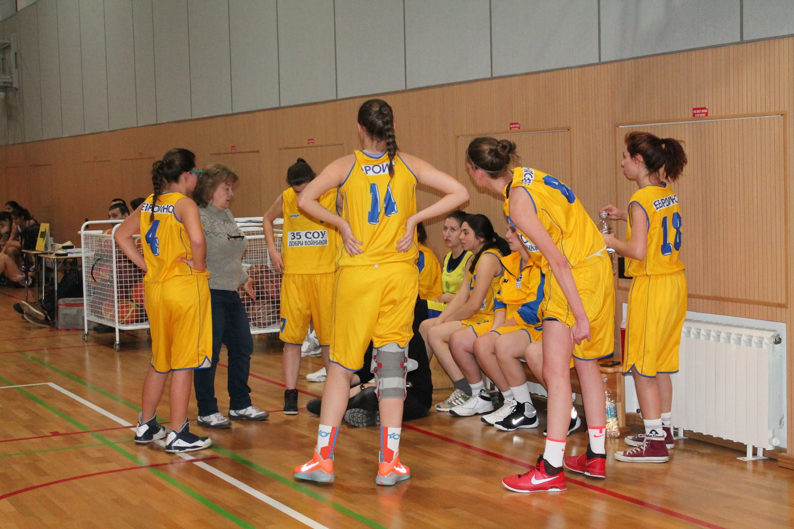
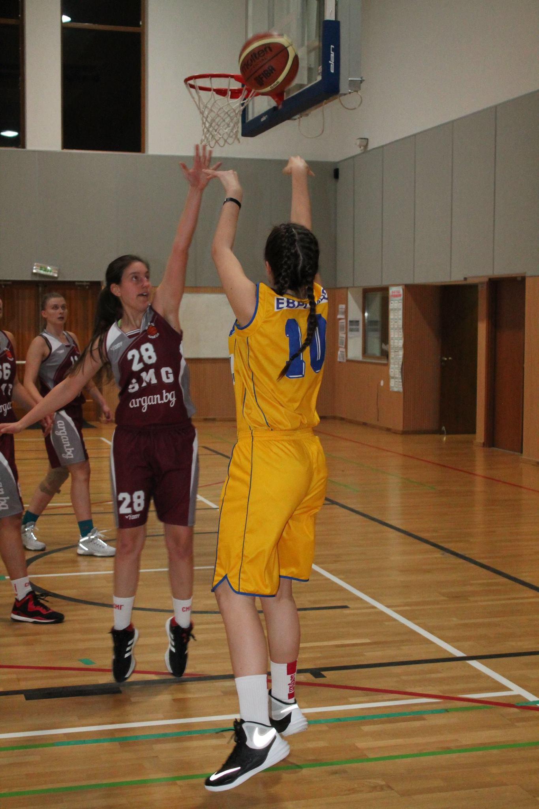

<link rel="stylesheet" type="text/css" href="https://cdn.datatables.net/1.10.23/css/jquery.dataTables.css">

<link rel="stylesheet" href="assets/css/magnific-popup.css">

<link rel="stylesheet" type="text/css" href="//cdn.jsdelivr.net/npm/slick-carousel@1.8.1/slick/slick.css"/>

## Hi! 👋

I am a software developer in the fin-tech industry. Previosuly, I worked as a web developer using Magento 2 and WordPress.

> "Where there is a will, there is a way!"

Back in 2016 I moved to the UK to get a university degree in Computer Science. Now I am working as a full-time software developer.

In my free time I like playing basketball 🏀  and building robots!  🤖

* * *

    <button class="tablinks active" onclick="openPart(event, 'Tech')">Tech</button>
    <button class="tablinks" onclick="openPart(event, 'Basketball')">Basketball</button>

<!-- Tab content -->

    <h3> Projects </h3>
    <table>
        <tr class='multiple-items'>
            <td></td>
            <td></td>
            <td></td>
        </tr>
    </table>
    <h3> Conferences and events </h3>
    
 Some of the perks that come with the job, apart from the free coffee and food in the office, are the different events and conferences I get to attend and sometimes present on different topics. 

    <ul>
        <li><a href='https://www.facebook.com/events/241612012910533/'>Capture the flag competition, South Wales 2017</a><i> (competitor)</i></li>
        <li><a href='https://www.facebook.com/events/1553254768040973/'>Cyber Security Challenge UK - Insights Camp, Birmingham 2017</a><i> (attendee)</i></li>
        <li><a href='http://uk.magetitans.com/'>Mage Titans, Manchester 2018</a><i> (attendee)</i></li>
        <li><a href='https://www.aber.ac.uk/~dcswww/Dept/Teaching/Industrial_Placement/IY/Gregynog.html'>Aberystwyth University Employability Weekend, Gregynog 2019</a><i> (presenter)</i></li>
        <li><a href='https://joeraut.com/posts/init.g/'>Google security conference - init.g, London 2019</a><i> (attendee)</i></li>
        <li><a href='https://targetjobs.co.uk/events/its-not-just-for-the-boys'>It's not just for the boys, London 2017 & 2020</a><i> (attendee)</i></li>
        <li><a href='https://bcswomenlovelace.bcs.org/?page_id=286'>Lovelace Colloqium, virtual 2020</a><i> (presenter)</i></li>
    </ul>
    <h3> Photo editing </h3>
    
My friend took up photography as a hobbby and I like helping him with some edits  👀  

    

    <h4> Tech related articles, books & videos </h4>
    
 In my spare time I enjoy reading about new and cool stuff hapenning in the tech world. Here are some of my favourites... 

    <!-- article, book & video -->
    

        <table id="articles" class="display" >
            <thead>
                <tr>
                    <th>Name</th>
                    <th>Type</th>
                </tr>
            </thead>
            <tbody>
                <tr>
                    <td><a href="https://medium.com/@pkontogiannis/software-engineers-playing-basketball-fa50e460a800">A software engineer is a basketball player… Part 1</a></td>
                    <td>article</td>
                </tr>
                <tr>
                    <td><a href="https://www.humanetech.com/podcast">Your Undivided Attention</a></td>
                    <td>podcast</td>
                </tr>
            </tbody>
        </table>
    

    <h3>Competitions</h3>
    
Point guard for the <b><i>Panthers</i></b> 2011-2016 from 35 high-school, Sofia BG.

    

        
        
        
        
    

